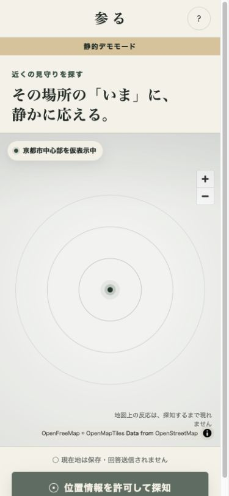
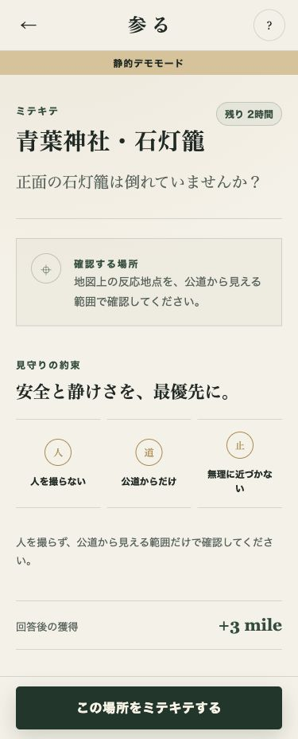
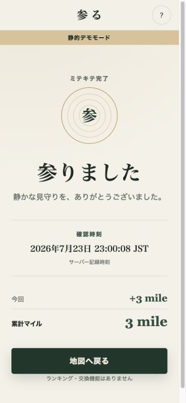
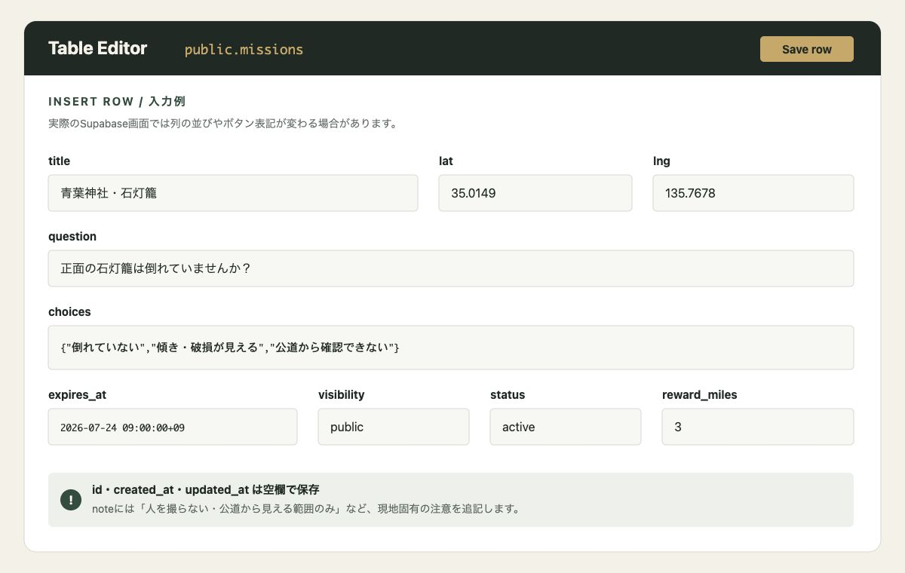

# 参る

> 参る。その場所のいまを、近くの誰かにミテキテもらう。

「参る」は、運営が地図上に置いた短時間の見守りミッション
（ミテキテ）に、近くを通った人が答えるサービスです。v0.1は
寺社の見守りを想定した、回答者向け公開面だけを実装しています。

- 依頼投稿画面・自由記述投稿はありません。
- 現在地は地図表示と端末内の距離計算だけに使い、保存・回答送信しません。
- 公開中かつ期限内の `public` ミッションだけを取得します。
- 他者の回答、回答数、達成率は公開しません。
- ランキングやマイル交換機能はありません。



## v0.1の4画面

1. **地図** — 現在地を中心に同心円を表示し、「周辺を探知」で期限付きの
   反応を浮かべます。一般的なピン一覧は使用しません。
2. **ミッション詳細** — 質問、残り期限、獲得マイル、安全上の注意を表示します。
3. **回答フォーム** — 単一選択と任意写真1枚。写真は端末上で長辺1600px・
   約1MBへ縮小し、EXIFを除去してから送ります。
4. **完了** — 「参りました」、サーバー確認時刻、今回と累計のマイルを表示します。

| ミッション詳細 | 完了 |
| --- | --- |
|  |  |

## 技術構成

- Vite + Vanilla TypeScript
- MapLibre GL JS
- OpenStreetMap Standard raster tiles
- Supabase Database / Anonymous Auth / Storage / RLS
- GitHub Pages（純静的ホスティング）
- Vitest

実行時依存は `maplibre-gl` と `@supabase/supabase-js` だけです。
画面ルーター、状態管理、UI、画像圧縮、PWA生成のライブラリは使用していません。

```text
ブラウザ
├─ 位置情報 ── 地図中心・距離計算だけ（メモリ上）
├─ MapLibre ── OpenStreetMap Standard raster tiles
└─ data-access contracts
   ├─ Demo repositories
   └─ Supabase repositories
      ├─ missions: 公開中・期限内のみRLSでSELECT
      ├─ submit_answer RPC: 時刻・匿名ID・マイルをサーバー確定
      └─ answer-photos: 非公開bucket
```

Supabase固有コードは [`src/data-access`](src/data-access) に閉じ込めています。
画面側は `MissionRepository` と `AnswerRepository` だけを参照します。

## ローカル起動

Node.js 22以上を使用します。

```bash
npm install
npm run dev
```

Supabase環境変数がなければ、架空の寺社3件を使う静的デモモードで起動します。
デモモードの回答・累計マイルはブラウザ内だけに保存し、写真は保存しません。
デモの確認時刻はブラウザ時計です。本番のサーバー時刻要件はSupabaseモードで
満たします。

本番相当の接続は `.env.example` を参考に `.env.local` を作成します。

```dotenv
VITE_SUPABASE_URL=https://YOUR_PROJECT.supabase.co
VITE_SUPABASE_PUBLISHABLE_KEY=sb_publishable_YOUR_KEY
VITE_DEMO_MODE=false
```

`VITE_` 変数はブラウザへ公開されます。ここに `service_role` keyを入れてはいけません。

## Supabase初期設定

発注者が行うアカウント・プロジェクト作成と、その後のCodexとの分担は
[`docs/supabase-setup.md`](docs/supabase-setup.md) にまとめています。

1. Supabase Freeで新しいプロジェクトを作成します。
2. Dashboardの **SQL Editor** で
   [`supabase/migrations/202607230001_initial_schema.sql`](supabase/migrations/202607230001_initial_schema.sql)
   を実行します。
3. 続けて
   [`supabase/migrations/202607250001_grant_mission_read.sql`](supabase/migrations/202607250001_grant_mission_read.sql)
   を実行します。
4. 同じくSQL Editorで [`supabase/seed.sql`](supabase/seed.sql) を実行します。
5. **Authentication → Sign In / Providers** で Anonymous Sign-Insを有効にします。
6. **Connect** または **Settings → API Keys** からPublishable keyを取得します。
7. **Integrations → Data API** からProject URLを確認し、
   GitHub Actions variablesへ登録します。

Anonymous Sign-Inはメールアドレス等を要求しませんが、匿名ユーザーも
`authenticated` ロールとしてRLSの対象になります。公開後はSupabaseが推奨する
CAPTCHA／Turnstile導入も検討してください。

ローカルSupabase CLIを使う場合は次でも初期化できます。

```bash
supabase start
supabase db reset
```

## 運営向け：ミッション登録手順

管理UIは作りません。Supabase DashboardのTable Editorを使います。

1. **Table Editor → public → missions** を開きます。
2. **Insert row** を選びます。
3. 下表に従って各列を入力します。
4. 保存後、公開面で反応が出ること、期限表示が正しいことを確認します。



上の画像は入力位置を説明する簡略図です。Supabase Dashboardの更新により、
実際の列順やボタン表記が変わることがあります。

| 列 | 入力方法 |
| --- | --- |
| `id` | 空欄。UUIDを自動生成 |
| `title` | 場所名＋確認対象。例：`青葉神社・石灯籠` |
| `lat` / `lng` | 緯度・経度。回答者の位置ではなくミッション地点 |
| `question` | 回答者へ表示する定型質問 |
| `choices` | Postgres配列。例：`{"問題なし","異常あり","確認できない"}` |
| `note` | 現地固有の注意。人を撮らない、公道からのみ、を必ず含める |
| `expires_at` | タイムゾーン付き日時 |
| `visibility` | v0.1の公開ミッションは `public` |
| `status` | 公開開始時に `active` |
| `reward_miles` | 初期運用は全件 `3` |

### 座標の取得方法

1. [OpenStreetMap](https://www.openstreetmap.org/) で対象地点を検索します。
2. 対象地点を右クリックし、住所・地点表示を開きます。
3. URLまたは地点情報に出る緯度・経度をコピーします。
4. `lat` が緯度、`lng` が経度です。逆に入力しないでください。
5. 保存後、公開面の地図で位置を必ず目視確認します。

座標は敷地内部の立入位置ではなく、回答者が公道から確認できる対象地点へ
置いてください。

### 有効期限の例

日本時間2026年7月24日9時までなら、次のように入力します。

```text
2026-07-24 09:00:00+09
```

期限延長は既存行の `expires_at` を更新します。終了させる場合は
`status = cancelled` にします。期限切れは公開面から自動的に消えます。

### limitedの扱い

`visibility = limited` はv0.1の公開面から一覧・詳細とも取得できません。
専用URLやトークンは実装していないため、v0.1では運営確認用の非公開状態として
だけ使用してください。

### 週1回の無料枠確認

Supabase Freeは無アクセスが続くとプロジェクトが一時停止されます。
毎週少なくとも1回、次を行ってください。

- Dashboardへアクセスする。
- 期限切れ・期限間近のミッションを確認する。
- 次週分のミッションを登録または更新する。
- 公開面で1回探知し、反応と期限を確認する。
- 写真削除ワークフローの成功を確認する。

## 運営向け：回答のCSVエクスポート

### Table Editorから

1. **Table Editor → public → answers** を開きます。
2. 必要に応じて `confirmed_at` で期間を絞ります。
3. **Export CSV** を選択し、ダウンロードします。

### SQL Editorから

次を実行し、結果欄のCSVダウンロードを使います。

```sql
select
  a.id,
  a.mission_id,
  m.title as mission_title,
  a.choice,
  a.photo_url,
  a.confirmed_at,
  a.anon_id,
  m.reward_miles
from public.answers a
join public.missions m on m.id = a.mission_id
order by a.confirmed_at desc;
```

`photo_url` は公開URLではなく、非公開bucket内のobject pathです。CSVや写真を
第三者へ渡す場合は、利用目的と必要性を改めて確認してください。

## 収集するデータ／収集しないデータ

### 収集するデータ

- Supabase Anonymous Authが発行する匿名ユーザーID
- ミッションID
- 選択した回答
- 任意で添付した写真1枚
- サーバーが記録した確認時刻
- ミッションごとの獲得マイル

サービス運用基盤では、不正防止・障害調査のためにIPアドレス等の標準的な
アクセスログが一時的に処理される場合があります。

### 収集しないデータ

- 回答者の現在地・移動履歴
- 氏名、メールアドレス、電話番号
- 自由記述の依頼や回答
- 連絡先、広告識別子
- プッシュ通知用トークン
- バックグラウンド位置情報
- 他者回答の公開用集計

地図を現在地へ動かす際は、表示に必要な地図タイルがOpenFreeMapへ要求されますが、
本サービスのDBへ現在地は送信しません。`MissionRepository` は位置引数を持たず、
公開ミッション取得後の距離計算を端末内で行います。

## 写真の保持と削除

- 写真bucket `answer-photos` は非公開です。
- 回答者以外へ公開するURLは発行しません。
- 保持期間は確認時刻から90日を目安とします。
- 90日経過後は写真本体を削除し、回答行の `photo_url` を `null` にします。
- 選択回答、確認時刻、匿名IDは集計用データとして残します。

公開GitHubリポジトリのActions secretsへ次を設定すると、毎週日曜に
[`scripts/purge-expired-photos.mjs`](scripts/purge-expired-photos.mjs) が実行されます。

- `SUPABASE_URL`
- `SUPABASE_SERVICE_ROLE_KEY`

`service_role` keyはGitHub Secretsと運営端末の環境変数以外へ置かず、
リポジトリへコミットしないでください。

手動実行例：

```bash
SUPABASE_URL=... \
SUPABASE_SERVICE_ROLE_KEY=... \
PHOTO_RETENTION_DAYS=90 \
npm run photos:purge
```

## 公開版（GitHub Pages）

公開版は <https://jtcpride.github.io/mile/> で公開しています。
`main` へのpush時にテストと本番ビルドを実行し、成功した成果物だけを
GitHub Pagesへ配信します。現在はSupabaseへ接続し、公開・進行中・期限内の
架空寺社seedだけをData APIから取得します。

接続値はリポジトリのActions variablesに
`VITE_SUPABASE_URL` と `VITE_SUPABASE_PUBLISHABLE_KEY` を登録し、
ビルド処理へ渡します。`service_role` keyは登録しません。

## Cloudflare Pagesへのデプロイ（代替）

1. この公開GitHubリポジトリをCloudflare Pagesへ接続します。
2. Framework presetは **Vite** を選択します。
3. Build commandを `npm run build` にします。
4. Build output directoryを `dist` にします。
5. Node.jsを22へ固定します。
6. `VITE_SUPABASE_URL` と `VITE_SUPABASE_PUBLISHABLE_KEY` を登録します。
7. デプロイ後、匿名認証、位置許可、回答、写真、時刻、重複拒否を実機で確認します。

`public/_redirects` がSPAの直接URLを、`public/_headers` がCSP等の
セキュリティヘッダーを設定します。Cloudflare Pages Functionsは使用しません。

Supabase接続値なしでデプロイした場合だけ静的デモモードになります。

## 検証

```bash
npm run check
npm run build
```

自動テストは次を検証します。

- 回答型・送信ペイロード・`answers` テーブルに現在地が存在しない。
- 公開取得条件に `public`、`active`、期限内がある。
- 1匿名ユーザー・1ミッション・1回答の一意制約がある。
- 確認時刻と匿名IDがサーバー既定値である。
- 写真bucketが非公開である。
- 距離と期限表示の基本動作。

## 設計と作業履歴

- 作業記録: [`WORKLOG.md`](WORKLOG.md)
- 設計判断: [`docs/decisions`](docs/decisions)
- 初期スキーマ: [`supabase/migrations`](supabase/migrations)
- 架空寺社seed: [`supabase/seed.sql`](supabase/seed.sql)

## ライセンス

[MIT](LICENSE)
